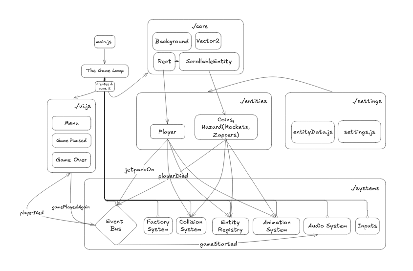

# Jetpack Joyride

## Overview

A replica of the popular game **Jetpack Joyride** and my second entry for the [20 game challenge](https://20_games_challenge.gitlab.io/challenge/). Built entirely on top of _my little custom engine_ that is using _Vanilla JS (HTML5 Canvas)._ Here's a [live preview](https://mazineezz.github.io/jetpack-joyride/)

## Controls

- On pc, press **"space"** to go up and **"escape"** to pause the game. On mobile, **hold** the game screen to go up.

P.S: Beware that there's a bug if you tried to pause the game in the first frames.

## Features

Many of the game engine's features are made prior to this game. To check a short description on each component visit [my games' template](https://github.com/MazineEZZ/game-template). Here are the new features I implemented for this specific project:

- **Memory System**: Made a simple storage system for highscores and coins using JS native's `localStorage`object.
- **Factories**: Procedural pattern-based level generation of which I made for rockets, zappers, and coins.
- **Particle System**: Simple particle system that is composed of three parts. _The particle_ itself, a _particle manager_ component that can be used for entities to spawn particles, a _particle registry_ system that basically keeps tracks of all particles to draw and update them.
- **Animation System**: An animation system I made in my [my games' template](https://github.com/MazineEZZ/game-template) to animate entities. On this version, animated sprites can be rotated.

## Architecture

The game's architecture follows four foundational blocks, which are represented in the diagram below:

## Tech Stack

- Vanilla JS.
- HTML5 Canvas.
- No framework/libraries.

## Known Limitations

- No settings/options menu (volume, controls remapping)
- Difficulty scaling is linear rather than tuned against playtesting data

This project was restricted to a smaller scope due to my miniscule knowledge in game dev. I tried to focus on implementing the core mechanics of the game and follow [the 20 game challenge](https://20_games_challenge.gitlab.io/challenge/) _goals_ to stay in scope.

## What's next?

Now that this project is finally done! I'm looking forward to my next game. I still haven't settled on whether I'll do [the 20 game challenge](https://20_games_challenge.gitlab.io/challenge/) provided games or do a similar game that follows the soul objectives.
